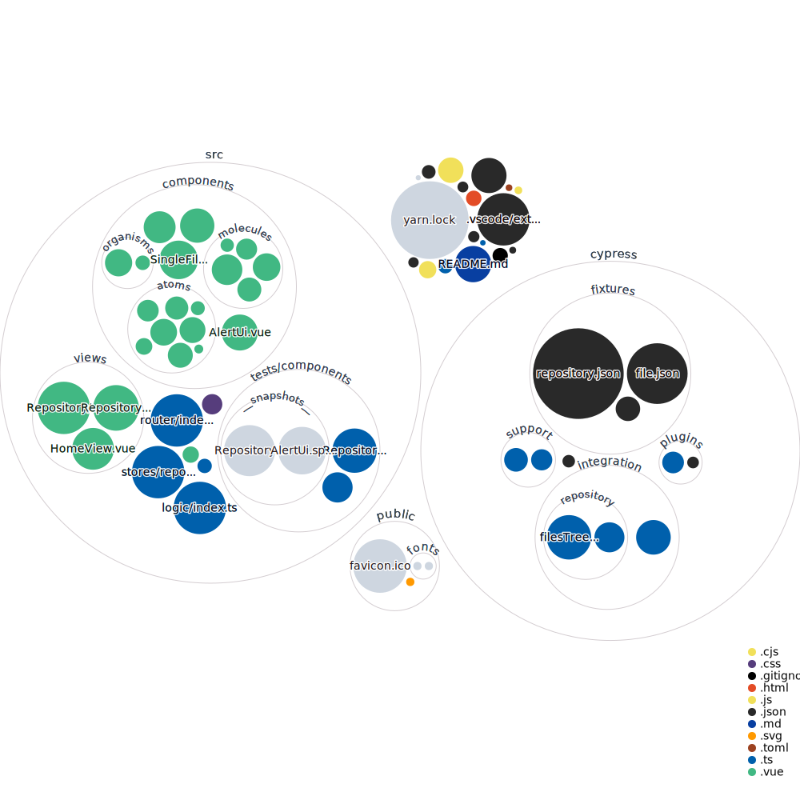

# github-repo-structure


The website is [currently live on Netlify](https://github-repo-structure.netlify.app/), with automatic deploys enabled.

### How to run the project locally

1. Clone the repository

	```sh
	git clone https://github.com/IonianPlayboy/github-repo-structure.git
	```

2. Install the project dependencies (with [yarn](https://classic.yarnpkg.com))

	```sh
	yarn
	```

3. Start the [Vite](https://vitejs.dev/) dev server

	```sh
	yarn dev
	```
	The website should now be running locally on `http://localhost:3000`


### Type-Check, Compile and Minify for Production

```sh
yarn build
```
You can then preview the production build of the website without deploying :
```sh
yarn preview
```
The production build should now be running locally on `http://localhost:5050/`

### Run Unit Tests with [Vitest](https://vitest.dev/)

```sh
yarn test:unit
```

### Run End-to-End Tests with [Cypress](https://www.cypress.io/)

```sh
yarn build
yarn test:e2e # or `yarn test:e2e:ci` for headless testing
```

### Lint with [ESLint](https://eslint.org/)

```sh
yarn lint
```

## Recommended IDE Setup

[VSCode](https://code.visualstudio.com/) + [Volar](https://marketplace.visualstudio.com/items?itemName=johnsoncodehk.volar) (and disable Vetur) + [TypeScript Vue Plugin (Volar)](https://marketplace.visualstudio.com/items?itemName=johnsoncodehk.vscode-typescript-vue-plugin).

[](https://mango-dune-07a8b7110.1.azurestaticapps.net/?repo=IonianPlayboy%2Fgithub-repo-structure)
